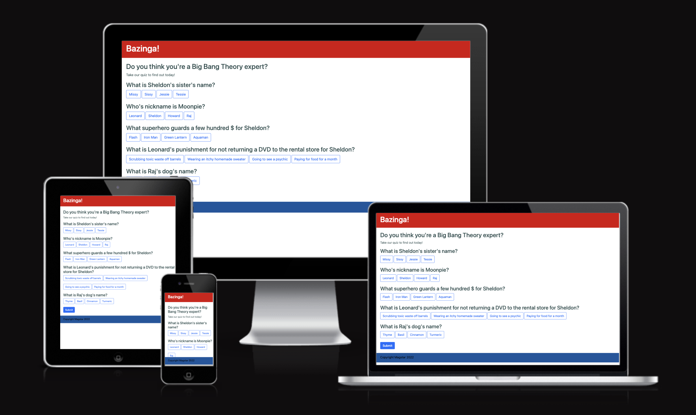
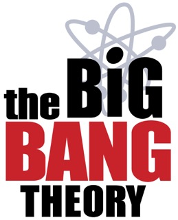

# Milestone 2 Project - Big Bang Theory Trivia Quiz

This project is designed to give people a little bit of entertainement while exercising their brain a little bit on a favourite subject.

## Table of contents

1. [Users](#users)
2. [Design](#design)
3. [Features](#features)
    1. [Quiz page](#quiz-page)
    2. [Results modal](#results-modal)
4. [Platforms](#platforms)
    1. [Languages used](#languages-used)
    2. [Frameworks, libraries and programmes](#frameworks-libraries-and-programmes)
5. [Testing](#testing)
6. [Future developments](#future-development)
7. [Deployment](#deployment)
8. [Credits](#credits)

## Users 

The intended users for this are:
1. New users just playing a game.
    - Fun to play.
    - Easy to understand.
    - Quick and not time consuming.
2. New users wanting to exercise their brain.
    - Stimulating for the brain.
    - Easy to pick up.
    - Educates with choices.

## Design

For this project, I decided to go for a simple clean design. The primary aim with this project was to figure out the mechanics of the quiz, rather than design something mindblowing.

However, I took inspiration from the Big Bang Theory logo for the colour scheme. I kept the rest of the design clean and simple - and used Bootstraps inherent button design. 

## Features

### Quiz page

Because of the structure of this application, only a singular page was utilised. 

The page is built entirely on Bootstrap, and the built in designs were used for ease. 

The buttons are from Bootstraps button library and for correct answers, the Success button is used, and Danger for incorrect. The buttons then also get disabled for each question when an answer is pressed, to avoid changing of answers.

In addition, the submit button is disabled and a Danger Alert from Bootstrap is used to warn a user that they cannot submit the quiz unless they select an answer for each question.

### Results modal

The Bootstrap modals are used to deliver the results to the user. These vary based on the total number of correct answers, with 3 different variations.

## Platforms

### Languages used
HTML5, CSS3 and JavaScript

### Frameworks, libraries and programmes

[Bootstrap 5.1](https://getbootstrap.com/)

I used the latest stable version of Bootstrap 5 to assist with the layout of the site and certain elements, such as the header and footer.

[GitPod](https://gitpod.io)

Used to create the code and sync to GitHub to push and commit.

[GitHub](https://github.com)

GitHub is used to store the code and repositories.

[Am I responsive?](https://ui.dev/amiresponsive)

This website was used to generate the responsive look image at the top of the README.

## Testing

Fully described in the [TESTING.md](TESTING.md) document.

## Future development

This project could absolutely be improved in many ways, as it was completed to be purely functional, rather than excellent ready-to-market.

First amend I'd make, and the one that irks me the most, is the design. The site is VERY simple and truly doesn't have much design. This could have been improved with more imagery, more interaction, maybe even a scrolling question by question interface. However due to health issues and holidays this project was already so delayed that I decided to focus on functionality, over design.

The other part I would have loved to have refined is the results modals. I wanted those to reflect the personality of each of the people who may have arrived at it, and include imagery (even gif's!) to communicate results.

In terms of functionality, as mentioned above, I may have gone for a more question by question reveal, but I think the quiz works really well.

Finally, I would have expanded it to be a larger site. Probably a bit of a Trivia section, maybe even have a list of questions in the background that randomly select 5 every time someone lands. 

## Deployment

This page was deployed using GitHub pages.

To deploy:

1. Open [GitHub](https://github.com/mutkovicova)
2. Navigate to the repository for Milestone 2 project
3. Click on Settings
4. Navigate to Pages, in the left hand side panel
5. Select 'Deploy from a branch' under Source
6. Select 'main' under Branch
7. Click the 'Save' button on the right hand side of the Branch menu.

## Credits

I would like to extend a special thank you to my friend Ariela, who sat with me whenever I was unmotivated with this project and is the only reason it has been finished, to be honest. The support of a senior dev, on the line, helped accelerate my troubleshooting and my understanding of the code I needed. 

Additionally, I'd love to thank Rachel, my supervisor from EKC Group, who didn't push too hard when she could tell I just couldn't do anything. We got there in the end!

