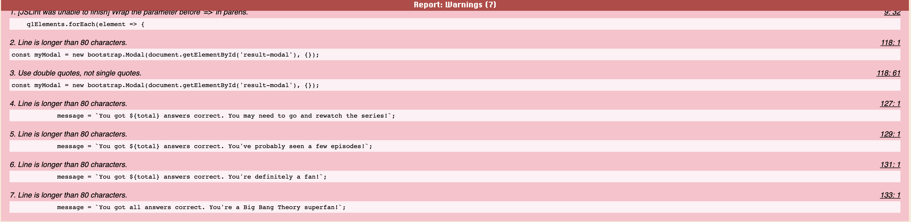
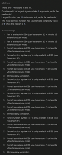
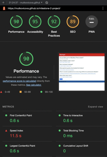

# Milestone 2 Project - Big Bang Theory quiz - Testing

## Table of contents

1. [Testing used](#testing-used)
2. [Manual code testing](#manual-code-testing)
    1. [In browser testing](#in-browser-testing)
    2. [JSLint](#jslint)
    3. [JSHint](#jshint)
    4. [Lighthouse](#lighthouse)
3. [User story testing](#user-testing)
4. [Additional testing](#additional-testingß)

## Testing used

Testing for applications such as this can be done either manually or automatically. Manual testing relies on me, the coder, to run the in-progress and finished code through testing, where deemed appropriate. Automated testing will conduct this continuously, allowing for potentially less correcting once the code is finished.

The testing I opted to use for this application was manual testing, using resources such as JSLint and JSHint. This was done because I felt it allowed me to run tests once I felt comfortable with the code.

Automated testing is brilliant, and allows coders to work on problems without running manual testing, however it would have distracted me in the beginning stages of learning JavaScript and I felt it would have slowed me down, rather than speed up.

## Manual code testing

### In browser testing

The code was continuously tested using Google DevTools in-browser. The parts that were most tested were:
1. Buttons and how they behave, and behave properly across all questions.
2. Incorrect input mitigation and alert when trying to submit without answering questions.
3. Modals responsive to total score variable within the quiz.

### JSLint

JSLint picked up a few errors, however they mostly consisted of the length of lines in the code, which refer to the text that sits within the modal. This may have been mitigated by pulling from another part, however it didn't feel that harmful to the site.

### JSHint

JSHint mainly disliked my use of const and let, and highlighted that these would not work in pre-ES6. Since this is almost non-existent in the modern world, this shouldn't be a problem. JSHint also highlighted a few places where I had, what they deemed to be, "unnecessary semicolons", however these were ones at the end of if statements within formulas, so I kept them.

### Lighthouse

I'm really happy with the Lighthouse testing and the 90% across the board apart from SEO. I think this is as could be expected for such a simple site.

## User story testing

This quiz only has two user stories, as it's a very simple site.

1. New users just playing a game.

<video src='assets/testing_files/user_story_1.mov' width=400 autoplay></video>

    - Fun to play.
    The tone I set with the initial explanation makes it clear that this is just for fun, and not to be taken seriously.

    - Easy to understand.
    The explanation provides the user with a basic breakdown of the site and therefore makes it easy to understand the objective. Once an answer is selected, the answers are disabled so it is clear that the next answer needs to be selected. In addition, the alert that shows if the submit button is pressed too early keeps the user on the questions.

    - Quick and not time consuming.
    The site only has 5 questions and therefore doesn't take long to use.

2. New users wanting to exercise their brain.

<video src='assets/testing_files/user_story_2.mov' width=400 autoplay></video>

    - Stimulating for the brain.
    The questions I picked aren't necessarily the easiest, and should provide challenge to all levels of fans of Big Bang Theory.
    
    - Easy to pick up.
    The instructions should make it easy enough to understand how to play the quiz.

    - Educates with choices.
    The answers will immediately notify the user if they got the question right, or wrong, therefore giving them to chance to quickly reflect on their choices, and potentially approach next question with more caution.

## Additional testing

Additional testing was conducted by friends who played the quiz and had success in doing so using the GitHub Pages publication.